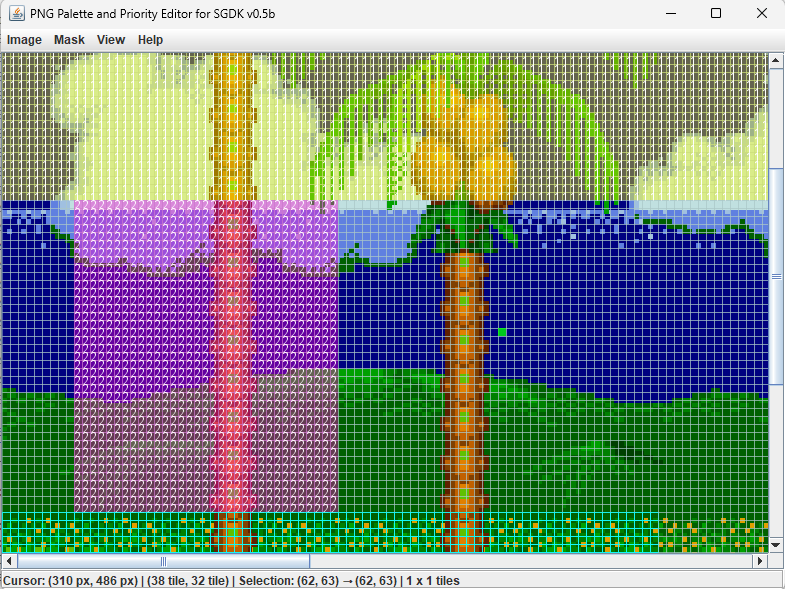

# PNG Palette and Priority Editor for SGDK  

PPP Editor for SGDK is a Java-based tool for editing palette and priority masks on indexed 8bpp PNG images, specifically designed for SGDK (Sega Genesis Development Kit) projects.

With PPP Editor, you can:  

✅ Load and visualize indexed 8bpp PNG images. 
✅ Edit palette indices (0-3) and priority flags (0/1) on an 8×8 tile grid. 
✅ Save this tile grid as a "mask" for future use 
✅ Export the final image with the applied mask (=palette and priority encoding). 
✅ Use a batch mode for automated processing via the command line. 

## Known issues
The tool is rather slow with bigger image... got to improve this indeed !
PNG above 1024x1024 tends to be laggy...and higher resolution may become unusable.

## Installation & Usage

### GUI Mode : 

Download PPPE4SGDK.jar 
To show the GUI , simply run with Java: "java -jar PPPE4SGDK.jar"

### 🏭 Batch Mode (Command Line Processing) 
Run the editor via the command line for automated processing: 
java -jar PPPE4SGDK.jar --b <image_path> <mask_path> <export_path>

Example: 
java -jar PPPE4SGDK.jar --b bgb.png mask.msk bgb_palprio.png

## Screenshots  

## Features :

🎨 Image & Mask Handling 
Load indexed 8bpp PNG images. 
Save and load .msk mask files to preserve tile properties. 

🖱️ Editing Capabilities 
Left Click & Drag → Lasso selection of multiple tiles. 
CTRL + Left Click → Add/remove multiple selection areas. 
Right Click → Open a property editor to modify Palette index (0-3) and Priority (0 = low, 1 = high) 

Keyboard Shortcuts: 
H → Set priority High (1) 
L → Set priority Low (0) 
0, 1, 2, 3 → Change palette index of selected tiles 
SHIFT + Mouse Wheel → zooming 
Arrow Keys → Scroll image 
CTRL+Z / CTRL+Y → undo / redo 

## License  
This project is open-source under the MIT License.

